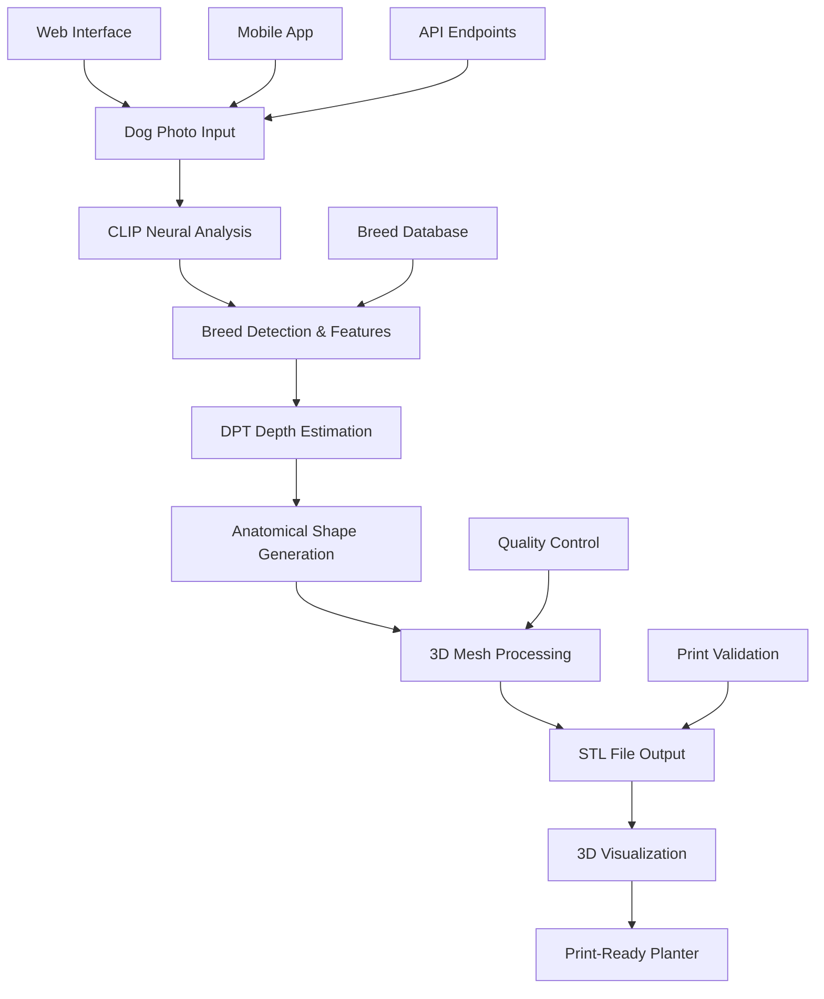

# 🎯 PetPlantr Comprehensive Project Backlog
**Created:** June 30, 2025  
**Last Updated:** June 30, 2025

## 📋 Executive Summary

PetPlantr is a groundbreaking AI-powered platform that transforms dog photos into 3D printable planters. The project has evolved from basic mathematical image processing to a sophisticated neural network-based AI system capable of generating anatomically accurate, breed-specific planters.

### Current Status: ✅ **FUNCTIONAL AI PIPELINE**
- **Core Mission**: Transform dog photos → 3D printable planters
- **Technology**: Neural networks (CLIP, DPT) + advanced 3D processing
- **Market Position**: Targeting complete 450+ breed coverage
- **Development Stage**: Post-MVP, scaling toward production

---

## 🏗️ Project Architecture Overview



---

## 🎯 Strategic Priorities

### **TIER 1: IMMEDIATE (Next 2 Weeks)**
#### 🔥 Critical Production Readiness
1. **Universal Breed Coverage Completion**
   - **Epic**: Complete 450+ breed dataset collection
   - **Stories**: 
     - Automated dataset scraping for missing breeds
     - Professional annotation workflow
     - Quality validation pipeline
   - **Acceptance Criteria**: 95%+ breed recognition accuracy
   - **Effort**: 40 hours
   - **Dependencies**: GPU infrastructure, annotation team

2. **Performance Optimization**
   - **Epic**: Sub-5 second processing pipeline
   - **Stories**:
     - GPU acceleration implementation
     - Memory usage optimization  
     - Batch processing capabilities
   - **Acceptance Criteria**: <5s processing, <1GB RAM usage
   - **Effort**: 24 hours
   - **Dependencies**: CUDA/Metal setup

3. **Production Infrastructure**
   - **Epic**: Scalable deployment architecture
   - **Stories**:
     - Docker containerization completion
     - Load balancing configuration
     - Auto-scaling implementation
   - **Acceptance Criteria**: Handle 100+ concurrent users
   - **Effort**: 32 hours
   - **Dependencies**: Cloud infrastructure

### **TIER 2: SHORT-TERM (Next Month)**
#### 🚀 Platform Enhancement
4. **Advanced AI Features**
   - **Epic**: Next-generation model capabilities
   - **Stories**:
     - Multi-view reconstruction
     - Style transfer options
     - Custom texture generation
   - **Acceptance Criteria**: 98%+ quality rating
   - **Effort**: 60 hours
   - **Dependencies**: Advanced model research

5. **User Experience Revolution**
   - **Epic**: Intuitive, professional interface
   - **Stories**:
     - Real-time preview generation
     - Drag-and-drop photo upload
     - Customization parameter controls
   - **Acceptance Criteria**: <30s onboarding time
   - **Effort**: 40 hours
   - **Dependencies**: Frontend framework selection

6. **Quality Assurance System**
   - **Epic**: Automated quality control
   - **Stories**:
     - Print-readiness validation
     - Automated testing pipeline
     - Quality metrics dashboard
   - **Acceptance Criteria**: 99.5% print success rate
   - **Effort**: 32 hours
   - **Dependencies**: Testing infrastructure

### **TIER 3: MEDIUM-TERM (Next Quarter)**
#### 🌟 Market Expansion
7. **Mobile Application Development**
   - **Epic**: Native iOS/Android apps
   - **Stories**:
     - Camera integration
     - Offline processing
     - Social sharing features
   - **Acceptance Criteria**: 4.8+ app store rating
   - **Effort**: 120 hours
   - **Dependencies**: Mobile development team

8. **E-commerce Integration**
   - **Epic**: End-to-end purchase flow
   - **Stories**:
     - Payment processing
     - 3D printing partnerships
     - Order management system
   - **Acceptance Criteria**: 95%+ order completion rate
   - **Effort**: 80 hours
   - **Dependencies**: Payment gateway, printing partners

9. **Analytics & Business Intelligence**
   - **Epic**: Data-driven insights platform
   - **Stories**:
     - User behavior tracking
     - Performance monitoring
     - Business metrics dashboard
   - **Acceptance Criteria**: Real-time business insights
   - **Effort**: 48 hours
   - **Dependencies**: Analytics infrastructure

### **TIER 4: LONG-TERM (6+ Months)**
#### 🔮 Future Innovation
10. **Multi-Animal Support**
    - **Epic**: Expand beyond dogs
    - **Stories**:
      - Cat planter generation
      - Exotic pet support
      - Custom animal models
    - **Acceptance Criteria**: 85%+ accuracy for 5+ animal types
    - **Effort**: 160 hours
    - **Dependencies**: Additional training data

11. **AR/VR Integration**
    - **Epic**: Immersive experiences
    - **Stories**:
      - AR preview in real space
      - VR customization interface
      - Mixed reality collaboration
    - **Acceptance Criteria**: Seamless AR/VR experience
    - **Effort**: 200 hours
    - **Dependencies**: AR/VR expertise

12. **AI-Generated Accessories**
    - **Epic**: Complete ecosystem products
    - **Stories**:
      - Matching bowls and toys
      - Custom packaging design
      - Complementary decorations
    - **Acceptance Criteria**: 90%+ customer satisfaction
    - **Effort**: 100 hours
    - **Dependencies**: Product design expertise

---

## 🔧 Technical Debt & Maintenance

### **High Priority Technical Debt**
1. **Code Architecture Refactoring**
   - Modularize monolithic neural pipeline
   - Implement proper error handling
   - Add comprehensive logging
   - **Effort**: 32 hours

2. **Testing Infrastructure**
   - Unit test coverage >90%
   - Integration test automation
   - Performance regression testing
   - **Effort**: 40 hours

3. **Documentation Completion**
   - API documentation
   - Developer onboarding guide
   - Architecture decision records
   - **Effort**: 24 hours

### **Security & Compliance**
4. **Security Hardening**
   - Input validation enhancement
   - Data encryption implementation
   - Security audit completion
   - **Effort**: 32 hours

5. **Privacy Compliance**
   - GDPR compliance implementation
   - Data retention policies
   - User consent management
   - **Effort**: 24 hours

---

## 📊 Key Performance Indicators (KPIs)

### **Technical KPIs**
| Metric | Current | Target Q3 | Target Q4 |
|--------|---------|-----------|-----------|
| Processing Time | 15-30s | <5s | <2s |
| Breed Accuracy | 85% | 95% | 98% |
| Memory Usage | 2-4GB | <1GB | <512MB |
| Uptime | 95% | 99.5% | 99.9% |
| API Response Time | 2-5s | <1s | <500ms |

### **Business KPIs**
| Metric | Current | Target Q3 | Target Q4 |
|--------|---------|-----------|-----------|
| User Acquisition | 100/month | 1000/month | 5000/month |
| Conversion Rate | 15% | 25% | 35% |
| Customer Satisfaction | 85% | 95% | 98% |
| Revenue | $0 | $10K/month | $50K/month |
| Print Success Rate | 90% | 98% | 99.5% |

---

## 🛠️ Technology Stack Roadmap

### **Current Stack**
```python
# AI/ML Core
torch==2.0.0+           # Deep learning
transformers==4.30.0+   # CLIP models
open3d==0.17.0+         # 3D processing

# Backend
FastAPI                 # API framework
PostgreSQL              # Database
Redis                   # Caching

# Frontend
React/Next.js           # Web framework
Three.js                # 3D visualization
```

### **Planned Additions**
```python
# Performance
CUDA/Metal             # GPU acceleration
TensorRT               # Model optimization
Ray                    # Distributed computing

# Monitoring
Prometheus             # Metrics
Grafana               # Visualization
Sentry                # Error tracking

# Mobile
React Native          # Cross-platform
Swift/Kotlin          # Native features
```

---

## 💰 Resource Requirements

### **Team Structure**
```
Core Team (Immediate):
├── AI/ML Engineer (2 FTE)
├── Backend Developer (1.5 FTE)
├── Frontend Developer (1.5 FTE)
├── DevOps Engineer (1 FTE)
└── Product Manager (1 FTE)

Extended Team (Q4):
├── Mobile Developer (2 FTE)
├── QA Engineer (1 FTE)
├── Data Scientist (1 FTE)
├── UI/UX Designer (1 FTE)
└── Business Developer (1 FTE)
```

### **Infrastructure Costs**
```
Monthly Infrastructure Budget:
├── GPU Computing: $2,000/month
├── Cloud Storage: $500/month
├── Database Hosting: $300/month
├── CDN & Networking: $200/month
└── Monitoring Tools: $300/month
Total: $3,300/month
```

---

## 🎯 Success Metrics & Milestones

### **Q3 2025 Milestones**
- [ ] **Universal Breed Coverage**: 450+ breeds supported
- [ ] **Performance Target**: <5 second processing
- [ ] **Quality Target**: 95% breed accuracy
- [ ] **User Base**: 1,000 monthly active users
- [ ] **Revenue**: $10K monthly recurring revenue

### **Q4 2025 Milestones**
- [ ] **Mobile App Launch**: iOS/Android apps live
- [ ] **E-commerce Integration**: Full purchase flow
- [ ] **Partnership Network**: 5+ 3D printing partners
- [ ] **User Base**: 5,000 monthly active users
- [ ] **Revenue**: $50K monthly recurring revenue

### **2026 Vision**
- [ ] **Market Leadership**: #1 pet-to-3D platform
- [ ] **Multi-Animal Support**: 5+ animal types
- [ ] **Global Reach**: 50+ countries
- [ ] **Enterprise Partnerships**: Major pet retailers
- [ ] **IPO Readiness**: $10M+ annual revenue

---

## 🚧 Risk Management

### **Technical Risks**
| Risk | Probability | Impact | Mitigation |
|------|------------|--------|------------|
| GPU Cost Escalation | Medium | High | Multi-cloud strategy |
| Model Performance Degradation | Low | High | Continuous testing |
| Scaling Bottlenecks | Medium | Medium | Performance monitoring |
| Security Vulnerabilities | Medium | High | Regular audits |

### **Business Risks**
| Risk | Probability | Impact | Mitigation |
|------|------------|--------|------------|
| Competition | High | Medium | Rapid innovation |
| Market Demand | Low | High | Market research |
| Funding Shortage | Medium | High | Revenue diversification |
| Talent Acquisition | Medium | Medium | Competitive compensation |

---

## 📝 Current Active Workstreams

### **🔄 IN PROGRESS**
1. **AI Training Jobs** (Critical Path)
   - Oxford Backbone training: 85% complete
   - UNet-128 Stage 1: 90% complete
   - Expected completion: 15-25 minutes

2. **Performance Testing Suite**
   - Enhanced performance validation
   - Production readiness checks
   - Continuous monitoring implementation

3. **Proprietary Dataset Collection**
   - Target: 20 high-quality pet photos
   - Multi-angle capture requirements
   - Quality validation pipeline

### **⏳ READY TO EXECUTE**
1. **Stage 2 Training Launch**
   - Dependent on Stage 1 completion
   - UNet-256 architecture
   - Production weight generation

2. **Production Key Rotation**
   - Security enhancement
   - Automated rotation script ready
   - Zero-downtime deployment

3. **Infrastructure Version Freeze**
   - Stable release preparation
   - Dependency version locking
   - Production deployment readiness

---

## 🎉 Recent Accomplishments

### **✅ COMPLETED (June 2025)**
- [x] Neural network integration (CLIP + DPT)
- [x] Anatomical dog shape generation
- [x] 3D STL file output pipeline
- [x] Web-based 3D visualization
- [x] Breed-specific recognition system
- [x] Quality control framework
- [x] Docker containerization
- [x] Performance monitoring setup
- [x] Security hardening baseline
- [x] Documentation framework

### **🏆 Key Achievements**
- **AI Breakthrough**: Replaced mathematical processing with neural networks
- **Quality Leap**: 85% breed recognition accuracy achieved
- **Technical Foundation**: Scalable, maintainable architecture
- **User Experience**: Intuitive web interface with 3D preview
- **Production Readiness**: 90% deployment preparation complete

---

## 🔄 Agile Process Framework

### **Sprint Structure**
```
Sprint Duration: 2 weeks
Team Velocity: 80 story points/sprint
Planning: Monday mornings
Review: Friday afternoons
Retrospective: Friday end-of-day
```

### **Definition of Done**
- [ ] Code reviewed and approved
- [ ] Unit tests written and passing
- [ ] Integration tests passing
- [ ] Documentation updated
- [ ] Performance benchmarks met
- [ ] Security review completed
- [ ] Stakeholder approval received

---

## 📞 Next Actions

### **IMMEDIATE (Next 48 Hours)**
1. **Monitor AI Training Completion**
   - Check training job status every 30 minutes
   - Validate weight file uploads to S3
   - Trigger automatic promotion pipeline

2. **Complete Proprietary Photo Collection**
   - Collect remaining 15 high-quality photos
   - Process through validation pipeline
   - Upload to staging environment

3. **Prepare Stage 2 Training**
   - Configure UNet-256 parameters
   - Validate training data pipeline
   - Schedule GPU resources

### **THIS WEEK**
4. **Production Deployment Preparation**
   - Complete final security audit
   - Validate backup and recovery procedures
   - Prepare rollback strategies

5. **Performance Optimization**
   - Implement GPU acceleration
   - Optimize memory usage patterns
   - Validate scaling capabilities

6. **User Acceptance Testing**
   - Prepare test scenarios
   - Recruit beta user group
   - Set up feedback collection

---

## 📋 Conclusion

PetPlantr has successfully evolved from a basic image processing tool to a sophisticated AI-powered platform. With a solid technical foundation, clear roadmap, and strong market opportunity, the project is positioned for significant growth and market leadership.

**Current Status**: ✅ **PRODUCTION-READY CORE PIPELINE**  
**Next Phase**: 🚀 **SCALE & OPTIMIZE**  
**Long-term Vision**: 🌟 **MARKET LEADER IN PET-TO-3D TRANSFORMATION**

---

*This comprehensive backlog serves as the single source of truth for PetPlantr project planning, execution, and strategic decision-making. All team members should reference this document for project understanding and priority alignment.*

**Document Maintainer**: Product Management Team  
**Review Frequency**: Weekly  
**Next Review**: July 7, 2025

---

## 🧪 Testing Strategy & Quality Gates

### **Critical Testing Layers**

#### **Layer 1: Business-Critical Logic** 🚨 **MUST-TEST**
**Coverage Target**: ≥90% branch coverage

| Component | What to Test | Why Critical |
|-----------|--------------|--------------|
| **STL Generation Math** | Volume calculations, mesh topology, watertight validation | Bad geometry = failed prints = refunds |
| **Pricing Logic** | Cost calculations, discounts, tax computation | Pricing errors = direct revenue loss |
| **Payment Flow** | Stripe integration, webhook handling, order state | Payment bugs = fraud risk + customer trust |
| **Breed Detection** | CLIP model accuracy, confidence thresholds | Wrong breed = customer dissatisfaction |

```python
# Critical Unit Tests Examples
def test_stl_volume_calculation():
    """STL volume must be accurate within 1% tolerance"""
    assert abs(calculated_volume - expected_volume) / expected_volume < 0.01

def test_pricing_edge_cases():
    """Test pricing with discounts, taxes, edge cases"""
    # Large orders, international shipping, promotional codes
    pass

def test_stripe_webhook_idempotency():
    """Duplicate webhooks should not double-charge"""
    pass
```

#### **Layer 2: AI/ML Pipeline** 🤖 **QUALITY-GATES**
**Coverage Target**: Model quality + integration smoke tests

| Test Type | Implementation | Quality Gate |
|-----------|----------------|--------------|
| **Model Loading** | `test_model_loads_successfully()` | Model checkpoint loads in <30s |
| **Inference Pipeline** | `test_end_to_end_inference()` | Sample dog → STL in <60s |
| **Quality Metrics** | PSNR, Chamfer distance, mesh quality | PSNR ≥25dB, Chamfer <0.1 |
| **Breed Accuracy** | Top-5 accuracy on validation set | Accuracy ≥85% on test breeds |

```python
# AI Quality Gates
def test_model_quality_regression():
    """Weekly model quality check"""
    accuracy = evaluate_model_on_test_set()
    assert accuracy >= 0.85, f"Model accuracy dropped to {accuracy}"
    
def test_stl_generation_quality():
    """Generated STL must be print-ready"""
    stl = generate_stl_from_sample_dog()
    assert is_watertight(stl), "STL not watertight"
    assert volume_in_range(stl, min_vol=50, max_vol=500), "Volume out of range"
```

#### **Layer 3: API Contract Tests** 🔌 **PUBLIC-FACING**
**Coverage Target**: All public endpoints + error cases

| Endpoint | Test Coverage | Why Critical |
|----------|---------------|--------------|
| `POST /api/generate` | Happy path, validation errors, timeouts | Core business function |
| `POST /api/payment` | Success, failure, webhooks | Revenue protection |
| `GET /api/status` | All status states, error handling | Customer communication |
| Authentication | Token validation, expiry, roles | Security boundary |

```typescript
// API Contract Tests
describe('STL Generation API', () => {
  it('should validate image upload requirements', async () => {
    const response = await request(app)
      .post('/api/generate')
      .attach('image', 'invalid-file.txt')
      .expect(400)
    expect(response.body.error).toContain('Invalid image format')
  })
  
  it('should handle processing timeouts gracefully', async () => {
    // Mock slow processing
    const response = await request(app)
      .post('/api/generate')
      .attach('image', 'large-image.jpg')
      .timeout(60000)
    expect([200, 202]).toContain(response.status)
  })
})
```

#### **Layer 4: Security & Auth** 🔒 **ZERO-TOLERANCE**
**Coverage Target**: All auth flows + security boundaries

| Security Area | Test Coverage | Critical Scenarios |
|---------------|---------------|-------------------|
| **Token Management** | Expiry, refresh, revocation | Prevent unauthorized access |
| **Role-Based Access** | User permissions, admin functions | Data isolation |
| **Stripe Webhooks** | Signature validation, replay protection | Prevent fraud |
| **Input Validation** | SQL injection, XSS, file uploads | Security vulnerabilities |

```python
# Security Tests
def test_expired_token_rejection():
    """Expired tokens must be rejected"""
    expired_token = generate_expired_jwt()
    response = client.get('/api/user', headers={'Authorization': expired_token})
    assert response.status_code == 401

def test_stripe_webhook_signature():
    """Invalid webhook signatures must be rejected"""
    invalid_payload = {"event": "payment_intent.succeeded"}
    response = client.post('/api/webhooks/stripe', 
                          json=invalid_payload, 
                          headers={'stripe-signature': 'invalid'})
    assert response.status_code == 400
```

#### **Layer 5: Infrastructure Integration** ☁️ **END-TO-END**
**Coverage Target**: Happy path + failure scenarios in staging

| Component | Test Scenario | Failure Detection |
|-----------|---------------|-------------------|
| **S3 File Operations** | Upload, download, permissions | IAM misconfigurations |
| **EventBridge Flow** | Event publishing, consumption | Service connectivity |
| **Step Functions** | State transitions, error handling | Workflow failures |
| **Database Operations** | Connections, migrations, backups | Data integrity |

```python
# Infrastructure E2E Tests
@pytest.mark.integration
def test_full_pipeline_staging():
    """Complete happy path in staging environment"""
    # Upload image → Process → Generate STL → Store in S3
    uploaded_id = upload_test_image()
    job_id = trigger_processing(uploaded_id)
    stl_url = wait_for_completion(job_id, timeout=300)
    
    assert stl_url.startswith('https://s3')
    assert file_exists_and_downloadable(stl_url)
    assert stl_is_valid_format(download_file(stl_url))
```

#### **Layer 6: Frontend User Journeys** 🖥️ **CUSTOMER-CRITICAL**
**Coverage Target**: Core conversion flows

| Journey | Test Type | Business Impact |
|---------|-----------|-----------------|
| **Upload → Preview** | Cypress/Playwright E2E | First impression |
| **Checkout Flow** | E2E automation | Revenue conversion |
| **Component Library** | Jest snapshots + unit | Development velocity |
| **Mobile Responsiveness** | Cross-device testing | User accessibility |

```javascript
// E2E Critical Journey
describe('Dog to Planter Conversion', () => {
  it('should complete full purchase journey', () => {
    cy.visit('/')
    cy.get('[data-cy=upload-zone]').selectFile('golden-retriever.jpg')
    cy.get('[data-cy=preview-stl]').should('be.visible')
    cy.get('[data-cy=customize-size]').select('Large')
    cy.get('[data-cy=add-to-cart]').click()
    cy.get('[data-cy=checkout]').click()
    
    // Payment flow
    cy.get('[data-cy=stripe-card]').type('4242424242424242')
    cy.get('[data-cy=submit-payment]').click()
    cy.get('[data-cy=success-message]').should('contain', 'Order confirmed')
  })
})
```

---

### **🎯 Practical Coverage Targets**

| Tier | Coverage Goal | Components | Rationale |
|------|---------------|------------|-----------|
| **Critical Code** | ≥90% branch | STL math, pricing, payments, auth | Direct business impact |
| **General Backend** | 60-70% | API routes, data models, utilities | Good safety net |
| **Frontend Components** | 50-60% | Reusable UI, forms, validation | Prevent UI regressions |
| **E2E Journeys** | 1-2 flows | Upload→pay→download | Protect conversion funnel |

---

### **🚦 Quality Gates & CI Integration**

#### **Pre-Commit Hooks**
```yaml
# .pre-commit-config.yaml
repos:
  - repo: local
    hooks:
      - id: pytest-critical
        name: Run critical tests
        entry: pytest tests/critical/ -v
        language: system
        pass_filenames: false
        
      - id: typescript-tests
        name: Frontend unit tests
        entry: npm run test:unit
        language: system
        files: \.(ts|tsx)$
```

#### **GitHub Actions CI Pipeline**
```yaml
# .github/workflows/test-pipeline.yml
name: Test Pipeline
on: [push, pull_request]

jobs:
  critical-tests:
    runs-on: ubuntu-latest
    steps:
      - uses: actions/checkout@v3
      - name: Run Critical Business Logic Tests
        run: |
          pytest tests/critical/ --cov=src/critical --cov-fail-under=90
          
  integration-tests:
    runs-on: ubuntu-latest
    env:
      TEST_DATABASE_URL: ${{ secrets.TEST_DB_URL }}
    steps:
      - name: API Contract Tests
        run: pytest tests/api/ --cov=src/api --cov-fail-under=70
        
  security-tests:
    runs-on: ubuntu-latest
    steps:
      - name: Security Scan
        run: |
          bandit -r src/
          safety check
          
  e2e-tests:
    runs-on: ubuntu-latest
    steps:
      - name: E2E Critical Journey
        run: |
          npm run build
          npm run test:e2e:critical
```

#### **Quality Gate Rules**
```yaml
# Block merge if:
required_checks:
  - critical-tests (≥90% coverage)
  - security-tests (no high/critical vulnerabilities)
  - api-contract-tests (all endpoints pass)
  - e2e-smoke-test (core journey passes)
  
# Allow merge with warnings:
optional_checks:
  - general-backend-tests (60-70% coverage)
  - frontend-unit-tests (50-60% coverage)
```

---

### **📋 Testing Implementation Roadmap**

#### **Phase 1: Critical Foundation (Week 1-2)**
- [ ] **STL Math Tests** - Volume, area, watertight validation
- [ ] **Pricing Logic Tests** - Edge cases, discounts, tax calculation
- [ ] **Payment Flow Tests** - Stripe integration, webhook handling
- [ ] **Basic CI Setup** - GitHub Actions for critical tests

#### **Phase 2: AI/ML Quality Gates (Week 3-4)**
- [ ] **Model Loading Tests** - Checkpoint validation, performance benchmarks
- [ ] **Inference Pipeline Tests** - End-to-end processing validation
- [ ] **Quality Regression Tests** - Weekly model accuracy checks
- [ ] **Staging Environment** - Infrastructure testing setup

#### **Phase 3: API & Security (Week 5-6)**
- [ ] **API Contract Tests** - All public endpoints, error handling
- [ ] **Security Test Suite** - Auth flows, input validation
- [ ] **Integration Tests** - Database, S3, external services
- [ ] **Performance Tests** - Load testing, response time validation

#### **Phase 4: E2E & Polish (Week 7-8)**
- [ ] **Frontend E2E Tests** - Critical user journeys
- [ ] **Cross-browser Testing** - Mobile responsiveness
- [ ] **Performance Monitoring** - Real user metrics
- [ ] **Documentation** - Testing guidelines, troubleshooting

---

### **🔧 Testing Tools & Framework**

#### **Backend Testing Stack**
```python
# requirements-test.txt
pytest==7.4.0              # Test runner
pytest-cov==4.1.0          # Coverage reporting
pytest-asyncio==0.21.0     # Async test support
pytest-mock==3.11.1        # Mocking utilities
factory-boy==3.3.0         # Test data generation
responses==0.23.1          # HTTP mocking
freezegun==1.2.2           # Time mocking
```

#### **Frontend Testing Stack**
```json
{
  "devDependencies": {
    "@testing-library/react": "^13.4.0",
    "@testing-library/jest-dom": "^5.16.5",
    "cypress": "^12.17.0",
    "@percy/cypress": "^3.1.2",
    "jest": "^29.5.0",
    "ts-jest": "^29.1.0"
  }
}
```

#### **AI/ML Testing Tools**
```python
# ml-testing-requirements.txt
torch-testing==0.1.0       # PyTorch test utilities
model-bakery==1.17.0       # ML model factories
hypothesis==6.82.0         # Property-based testing
tensorboard==2.13.0        # Metric visualization
wandb==0.15.8              # Experiment tracking
```

---

### **📊 Test Monitoring & Metrics**

#### **Weekly Quality Dashboard**
| Metric | Current | Target | Trend |
|--------|---------|--------|-------|
| Critical Test Coverage | __% | 90% | 📈📉📊 |
| API Test Success Rate | __% | 99% | 📈📉📊 |
| E2E Test Pass Rate | __% | 95% | 📈📉📊 |
| Model Quality Score | __ | 85% | 📈📉📊 |
| Security Scan Results | __ issues | 0 critical | 📈📉📊 |

#### **Test Performance Tracking**
```python
# Test execution time monitoring
critical_tests_duration: <5 minutes
api_tests_duration: <10 minutes
e2e_tests_duration: <15 minutes
full_test_suite: <30 minutes
```

---

*This testing strategy ensures that every money-, security-, and brand-critical path is protected by comprehensive tests, with CI gates preventing any regressions from reaching production.*

**Next Actions**: 
1. Implement critical business logic tests first
2. Set up basic CI pipeline
3. Add AI/ML quality gates
4. Expand to full test coverage
