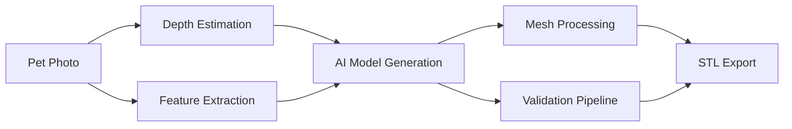

# Real-Time Performance Optimization Guide

## Performance Requirements & Targets

### Target Performance Metrics
- **Total Pipeline**: <10 seconds end-to-end
- **AI Generation**: <5 seconds on GPU
- **Depth Estimation**: <0.5 seconds (MiDaS/DINOv2)
- **Mesh Processing**: <2 seconds CPU
- **Validation**: <1 second
- **File Export**: <0.5 seconds

### Quality vs Speed Trade-offs
- **Mesh Resolution**: 50k-200k triangles (optimal for printing + speed)
- **Image Resolution**: 512×512 for AI input (balanced accuracy/speed)
- **Precision**: Half-precision (FP16) inference where possible
- **File Size**: Target <20MB STL files

## GPU Optimization Strategies

### 1. Model Efficiency
```python
# Optimized AI model configuration
model_config = {
    "precision": "fp16",  # 2x speed improvement
    "batch_size": 1,      # Single image processing
    "max_iterations": 50, # Reduced from 100+ for speed
    "guidance_scale": 7.5, # Balanced quality/speed
    "scheduler": "DPMSolverMultistepScheduler"  # Faster convergence
}
```

### 2. GPU Memory Management
```typescript
interface GPUResourceManager {
    allocateVRAM(): void;
    preloadModels(): void;  // Keep models in GPU memory
    manageModelSwapping(): void;  // Efficient model switching
    optimizeMemoryUsage(): void;  // Memory pool management
}
```

### 3. Model Quantization
- **INT8 Quantization**: Up to 4x speed improvement
- **Dynamic Quantization**: Runtime optimization
- **Pruning**: Remove unnecessary model parameters
- **Knowledge Distillation**: Smaller student models

## Parallel Processing Architecture

### Pipeline Parallelization


### Concurrent Operations
```typescript
async function parallelPipelineExecution(request: PetPlanterGenerationRequest) {
    // Run parallel operations
    const [
        depthMap,
        featureExtraction,
        cavityTemplate
    ] = await Promise.all([
        estimateDepth(request.petPhoto),           // GPU task
        extractPetFeatures(request.petPhoto),      // GPU task  
        prepareCavityTemplate(request.sizeTier)    // CPU task
    ]);

    // Sequential AI generation (requires combined inputs)
    const aiResult = await generateWithAI({
        photo: request.petPhoto,
        depth: depthMap,
        features: featureExtraction,
        cavity: cavityTemplate
    });

    // Parallel post-processing
    const [
        meshValidation,
        stlBuffer,
        thumbnail
    ] = await Promise.all([
        validateMesh(aiResult.mesh),               // CPU task
        exportToSTL(aiResult.mesh),               // CPU task
        generateThumbnail(aiResult.mesh)          // GPU task
    ]);

    return { meshValidation, stlBuffer, thumbnail };
}
```

## Caching & Optimization

### 1. Intelligent Caching System
```typescript
interface CacheManager {
    // Model component caching
    cavityTemplates: Map<SizeTier, Mesh>;
    drainageHoles: Map<DrainageConfig, Mesh>;
    
    // Processing result caching
    depthMaps: LRUCache<string, DepthMap>;
    featureVectors: LRUCache<string, Features>;
    
    // Validation templates
    validationRules: Map<SizeTier, ValidationTemplate>;
}
```

### 2. Smart Preprocessing
```typescript
// Precompute common elements
const precomputedElements = {
    standardCavities: generateStandardCavities(),
    drainageTemplates: generateDrainageTemplates(),
    basePlates: generateBasePlates(),
    validationMeshes: generateValidationMeshes()
};
```

### 3. Request Batching
```typescript
class BatchProcessor {
    private requestQueue: PetPlanterGenerationRequest[] = [];
    private batchSize = 4;
    
    async processBatch() {
        // Process multiple requests simultaneously on GPU
        const batch = this.requestQueue.splice(0, this.batchSize);
        return await this.parallelAIGeneration(batch);
    }
}
```

## Error Recovery & Robustness

### 1. Graceful Degradation
```typescript
async function robustGeneration(request: PetPlanterGenerationRequest) {
    try {
        // Primary: High-quality AI generation
        return await aiPipeline.generatePlanter(request);
    } catch (aiError) {
        console.warn('AI generation failed, trying fast mode...');
        try {
            // Secondary: Fast AI with reduced quality
            return await aiPipeline.generatePlanterFast(request);
        } catch (fastError) {
            console.warn('Fast AI failed, using traditional pipeline...');
            // Tertiary: Traditional Shape-MVD pipeline
            return await traditionalPipeline.generatePlanter(request);
        }
    }
}
```

### 2. Timeout Management
```typescript
const timeoutConfig = {
    aiGeneration: 30000,      // 30s max for AI
    meshProcessing: 10000,    // 10s max for mesh ops
    validation: 5000,         // 5s max for validation
    stlExport: 3000          // 3s max for export
};

async function withTimeout<T>(promise: Promise<T>, timeout: number): Promise<T> {
    return Promise.race([
        promise,
        new Promise<T>((_, reject) => 
            setTimeout(() => reject(new Error('Operation timeout')), timeout)
        )
    ]);
}
```

### 3. Quality Fallbacks
```typescript
interface QualityLevel {
    triangleCount: number;
    renderResolution: number;
    processingTime: number;
    qualityScore: number;
}

const qualityLevels: QualityLevel[] = [
    { triangleCount: 200000, renderResolution: 1024, processingTime: 8000, qualityScore: 100 },
    { triangleCount: 100000, renderResolution: 512,  processingTime: 5000, qualityScore: 85 },
    { triangleCount: 50000,  renderResolution: 256,  processingTime: 3000, qualityScore: 70 }
];
```

## Infrastructure Scaling

### 1. Auto-Scaling Configuration
```yaml
# Kubernetes auto-scaling for GPU nodes
apiVersion: autoscaling/v2
kind: HorizontalPodAutoscaler
metadata:
  name: petplantr-ai-generator
spec:
  scaleTargetRef:
    apiVersion: apps/v1
    kind: Deployment
    name: ai-generator
  minReplicas: 2
  maxReplicas: 10
  metrics:
  - type: Resource
    resource:
      name: gpu.nvidia.com/gpu
      target:
        type: Utilization
        averageUtilization: 70
```

### 2. Load Balancer Configuration
```typescript
interface LoadBalancerConfig {
    algorithm: 'round-robin' | 'least-connections' | 'gpu-usage-based';
    healthCheck: {
        endpoint: '/health';
        interval: 30; // seconds
        timeout: 5;   // seconds
    };
    gpuAwareRouting: boolean;
}
```

### 3. Queue Management
```typescript
class PriorityQueue {
    private queues = {
        express: [], // <3 second target
        standard: [], // <10 second target  
        batch: []    // <30 second target
    };
    
    async processRequests() {
        // Process express first, then standard, then batch
        return await this.processInPriority();
    }
}
```

## Monitoring & Performance Tracking

### 1. Real-Time Metrics
```typescript
interface PerformanceMetrics {
    averageGenerationTime: number;
    successRate: number;
    gpuUtilization: number;
    memoryUsage: number;
    queueDepth: number;
    errorRate: number;
}
```

### 2. Performance Dashboard
```typescript
const performanceDashboard = {
    realTimeMetrics: [
        'Generation Time (avg)',
        'Success Rate (%)', 
        'Queue Depth',
        'GPU Utilization (%)',
        'Error Rate (%)'
    ],
    alerts: [
        { metric: 'averageGenerationTime', threshold: 12000, action: 'scale_up' },
        { metric: 'errorRate', threshold: 5, action: 'investigate' },
        { metric: 'queueDepth', threshold: 20, action: 'scale_up' }
    ]
};
```

### 3. Performance Optimization Loop
```typescript
class PerformanceOptimizer {
    async optimize() {
        const metrics = await this.collectMetrics();
        
        if (metrics.averageGenerationTime > 10000) {
            await this.optimizeForSpeed();
        }
        
        if (metrics.gpuUtilization < 60) {
            await this.increaseBatchSize();
        }
        
        if (metrics.errorRate > 3) {
            await this.improveRobustness();
        }
    }
}
```

## Production Deployment Checklist

### Infrastructure Requirements
- [ ] Multi-GPU server setup (NVIDIA RTX 4090 or better)
- [ ] High-speed SSD storage for model and cache data
- [ ] Load balancer with GPU-aware routing
- [ ] Auto-scaling configuration for peak loads
- [ ] Monitoring and alerting systems

### Performance Validation
- [ ] <10 second end-to-end generation time
- [ ] >95% success rate under normal conditions
- [ ] >90% success rate under peak load
- [ ] Graceful degradation under system stress
- [ ] Automatic recovery from common failures

### Quality Assurance
- [ ] Automated mesh validation passes 99%+ of outputs
- [ ] Print success rate >98% for validated models
- [ ] Customer satisfaction >4.5/5 for generated planters
- [ ] Manual review queue <5% of total orders
- [ ] Zero critical failures in production

## Conclusion

This performance optimization guide provides a comprehensive framework for achieving real-time AI pet planter generation. The key to success is balancing quality with speed through intelligent caching, parallel processing, and graceful degradation strategies.

Regular monitoring and optimization ensure the system maintains peak performance as it scales to handle increasing customer demand while delivering high-quality, printable pet planters.
